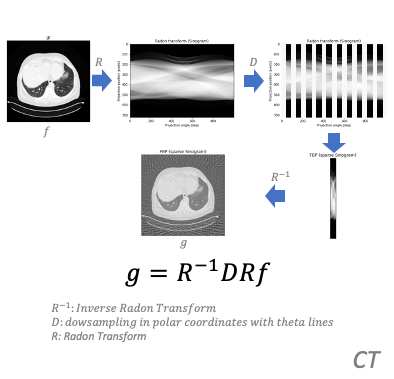
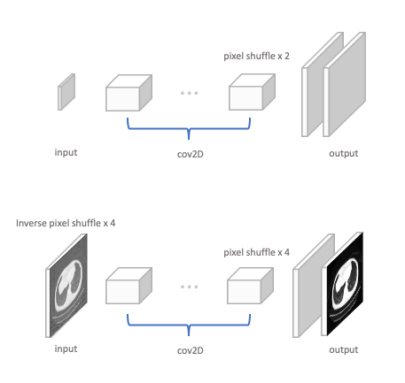

# Single Image Super Resolution on CT scans

[](https://opensource.org/licenses/Apache-2.0)


The above figure shows an example outcome of the CT-adapted [SISR](https://github.com/jason-zl190/sisr.git) model. The [dataset](https://github.com/jason-zl190/datasets.git) is provided by [NIH Deeplesion](https://nihcc.app.box.com/v/DeepLesion). 


## Quick Start

### Adaptd Model
<p align="center">
  
</p>

Degradation of an optical image, like a phone camera captured image, happens in spatial space. On the contrary, the degradation of CT scans occurs in radon space, according to FBP(filtered back projection) reconstruction process. Therefore, the low-resolution observations of CT scans can be obtained by the above degradation model.

<p align="center">
  
</p>

The above figure shows two SISR model structures. The original model is shown on the top. The CT-adapted SISR model is shown on the bottom.

### Metrics

| NIH Deeplesion(CT)  | Bicubic           | SRResNet/SRGAN  | HR |
| :-------------:     |:-------------:    | :-----:         |:--:|
| PSNR                | 13.32             | 31.24           |  |
| SSIM                | 0.40              |   0.86          | 1  |

### Training the model from scratch
The repo was designed to be run in Google Cloud and makes use of GCS for logging. 
It contains three training tasks, which are `srresnet_task`, `discriminator_task` and `srgan_task`. 

`srresnet_task` trains the generator of the srgan solely, `discriminator_task` trains the discriminator of the srgan solely and `srgan_task` trains both the generator and the discriminator jointly.

To train the srresnet, the generator solely, using
```
python3 -m trainer.srgan_task --job-dir 'gs://<project>/<path to store tensorboard jobs>'
```

To train the discriminator solely, using
```
python3 -m trainer.discriminator_task --job-dir 'gs://<project>/<path to store tensorboard jobs>'
```

To train srgan, the generator and discriminator jointly, using
```
python3 -m trainer.srgan_task --job-dir 'gs://<project>/<path to store tensorboard jobs>'
```

To use pretrained weight, specify the weight paths by setting the parameters: `g_weight` and `d_weight`. E.g.
```
python3 -m trainer.srgan_task --g_weight '<pretrained generator weight path>' --d_weight 'pretrained discriminator weight path' --job-dir 'gs://<project>/<path to store tensorboard jobs>'
```

More custom training parameters can be set by reading the configuration file: `trainer/config.py`

## License
Copyright 2019 Zisheng Liang

Licensed under the Apache License, Version 2.0 (the "License"); you may not use this file except in compliance with the License. You may obtain a copy of the License at

http://www.apache.org/licenses/LICENSE-2.0

Unless required by applicable law or agreed to in writing, software distributed under the License is distributed on an "AS IS" BASIS, WITHOUT WARRANTIES OR CONDITIONS OF ANY KIND, either express or implied. See the License for the specific language governing permissions and limitations under the License.

## Citing
```
@article{DBLP:journals/corr/LedigTHCATTWS16,
  author    = {Christian Ledig and
               Lucas Theis and
               Ferenc Huszar and
               Jose Caballero and
               Andrew P. Aitken and
               Alykhan Tejani and
               Johannes Totz and
               Zehan Wang and
               Wenzhe Shi},
  title     = {Photo-Realistic Single Image Super-Resolution Using a Generative Adversarial
               Network},
  journal   = {CoRR},
  volume    = {abs/1609.04802},
  year      = {2016},
  url       = {http://arxiv.org/abs/1609.04802},
  archivePrefix = {arXiv},
  eprint    = {1609.04802},
  timestamp = {Mon, 13 Aug 2018 16:48:38 +0200},
  biburl    = {https://dblp.org/rec/bib/journals/corr/LedigTHCATTWS16},
  bibsource = {dblp computer science bibliography, https://dblp.org}
}
```
